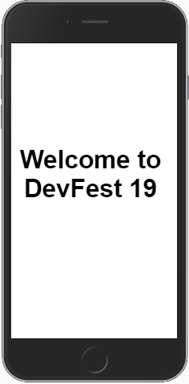

# Hello GDG Porto-Novo
The classic Hello GDG Porto-Novo program as a Progressive Web App

## What It Is

A simple PWA demo that displays the text "Welcome to DevFest 19" utilizing an app manifest, service workers and caching. This demo is written in plain-vanilla HTML, CSS and Javascript (ES6). It has no dependencies.

## Demo

https://github.com/Duamelo/Duamelo.github.io.git

## Browser Compatibility

Hello GDG has been tested in the following browsers:

* Chrome 67 (Windows and Android)
* Firefox 60
* Safari 11
* Edge 42
